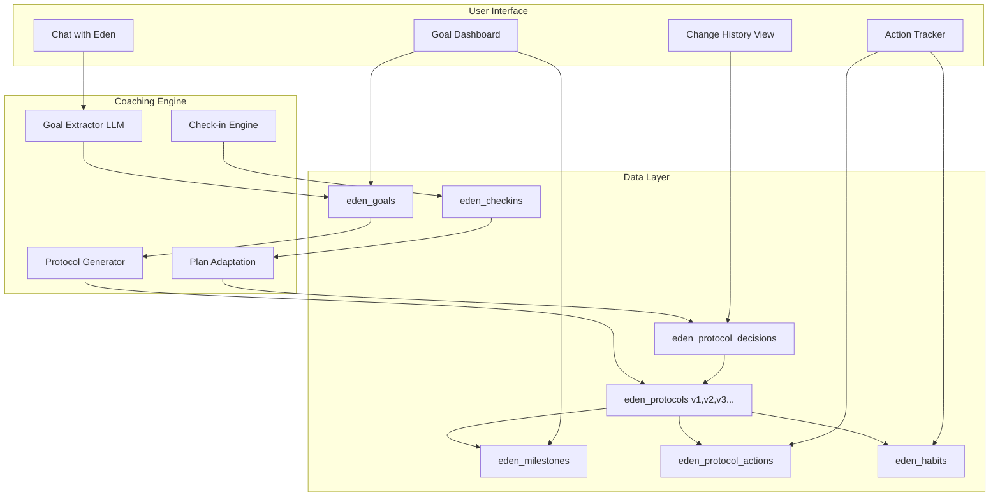
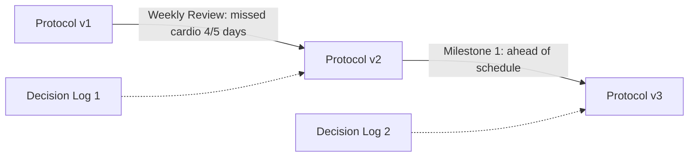

# Eden Coaching & Protocol System

## Overview

Transform Eden from a chat-based advisor into a full coaching platform. Users will conversationally define goals with Eden, receive AI-generated protocols with milestones and daily actions, track progress through a dedicated UI, and get proactive coaching that adapts to their journey.---

## Architecture



---

## Data Model

### New Tables

| Table | Purpose ||-------|---------|| `eden_goals` | User's committed goals with type, target, timeline || `eden_protocols` | Generated protocol tied to a goal (phases, duration) - versioned || `eden_protocol_decisions` | Decision log: why protocol changed, expected outcome, re-eval date || `eden_milestones` | Checkpoints within a protocol (e.g., "Week 4: Complete first 5K") || `eden_protocol_actions` | Weekly/daily actions with completion tracking || `eden_habits` | Daily habits to track with streaks || `eden_habit_logs` | Individual habit completion entries || `eden_checkins` | Periodic check-in responses (weekly reviews, milestone reviews) |

### Tables to DELETE (replaced by above)

| Old Table | Reason ||-----------|--------|| `eden_plans` | Replaced by `eden_protocols` (versioned, goal-linked) || `eden_plan_actions` | Replaced by `eden_protocol_actions` (with completion tracking) |

### Key Schema Additions

**`eden_goals`**:

- `goal_type`: domain | outcome | composite
- `domain`: heart | frame | metabolism | recovery | mind (nullable for outcome goals)
- `target_description`: "Improve Heart score from 52 to 70"
- `target_metric_code`: e.g., "prime_heart" (nullable)
- `target_value`: numeric target (nullable)
- `baseline_value`: starting value from scorecard
- `duration_weeks`: user-selected duration
- `constraints_json`: JSONB - goal-specific constraints captured at commitment (injuries, limitations, red lines)
- `status`: draft | active | completed | paused | abandoned

**`eden_protocols`** (versioned):

- `id`: uuid PK
- `goal_id`: FK to eden_goals
- `version`: integer (1, 2, 3...) - increments on each adaptation
- `parent_version_id`: FK to eden_protocols (nullable) - links to previous version for diff
- `focus_summary`: LLM-generated summary
- `total_phases`: number of milestone phases
- `current_phase`: which phase user is in
- `status`: active | superseded | archived
- `effective_from`: timestamp when this version became active
- `effective_until`: timestamp when superseded (nullable)
- `llm_raw`: raw protocol generation response
- `changes_from_parent`: JSONB diff summary (what changed from previous version)

**`eden_protocol_decisions`** (accountability log):

- `id`: uuid PK
- `protocol_id`: FK to eden_protocols (the NEW version created by this decision)
- `trigger_type`: weekly_review | milestone_review | user_request | metric_change | coach_recommendation
- `trigger_context`: JSONB - what data triggered the decision (e.g., missed actions, scorecard change)
- `reason`: text - human-readable explanation ("You completed 80% of actions but cardio habit was consistently missed")
- `changes_made`: JSONB - structured diff of what changed
- `expected_outcome`: text - what we expect to improve ("Better habit adherence with shorter morning routine")
- `reevaluate_at`: date - when to check if this change worked
- `outcome_notes`: text (nullable) - filled in at re-evaluation
- `outcome_status`: pending | successful | unsuccessful | mixed (nullable)
- `created_at`: timestamp

**`eden_milestones`**:

- `protocol_id`: FK
- `phase_number`: 1, 2, 3...
- `title`: "Foundation Phase"
- `target_date`: expected completion
- `success_criteria`: what defines milestone completion
- `status`: pending | current | completed | skipped

**`eden_habits`**:

- `protocol_id`: FK
- `title`: "10-min morning walk"
- `frequency`: daily | weekdays | 3x_week | custom
- `current_streak`: days in a row
- `best_streak`: longest streak achieved

---

## Protocol Versioning & Accountability

Every protocol adaptation creates a new version, preserving full history and enabling users to understand why their plan changed.

### Version Chain




### How Adaptations Work

1. **Trigger detected**: Weekly review, milestone completion, user request, or metric change
2. **Decision created**: System logs what triggered the change and context
3. **New version generated**: LLM creates adapted protocol with explicit changes
4. **Diff stored**: `changes_from_parent` captures exactly what changed (added/removed actions, habit frequency changes, milestone adjustments)
5. **Re-evaluation scheduled**: Every decision has a `reevaluate_at` date
6. **Outcome tracked**: At re-eval, system/coach notes if the change worked

### User-Facing Transparency

Users can see:

- **Current protocol** with version indicator (e.g., "v3 - updated Jan 5")
- **Change history**: "Why did my plan change?" shows decision log in plain language
- **What changed**: Visual diff of actions/habits before and after
- **Expected outcome**: What Eden expected to improve
- **Outcome status**: Did the change work? (after re-evaluation)

### Example Decision Log Entry

```json
{
  "trigger_type": "weekly_review",
  "trigger_context": {
    "week": 2,
    "actions_completed": 3,
    "actions_total": 5,
    "habits": { "morning_walk": { "completed": 2, "target": 7 } }
  },
  "reason": "Morning walk habit had low adherence (2/7 days). You mentioned mornings are rushed.",
  "changes_made": {
    "habits": {
      "removed": ["morning_walk"],
      "added": ["post_lunch_walk"]
    }
  },
  "expected_outcome": "Moving walk to post-lunch when you have more flexibility should improve adherence.",
  "reevaluate_at": "2026-01-12"
}
```

---

## Constraints & Safety Rails

### Capture Points

1. **At goal commitment**: Eden proactively asks "Before we build your plan, anything I should know? Injuries, limitations, things you can't or won't do?" Stored in `eden_goals.constraints_json`.
2. **Ongoing in chat**: If user mentions constraints mid-conversation ("my knee has been bothering me", "I can't do mornings"), Eden extracts and updates:

- Goal-specific constraints → `eden_goals.constraints_json`
- Global constraints → `eden_user_state.safety_json`

### Constraint Structure

```typescript
// Goal-specific constraints (eden_goals.constraints_json)
{
  injuries: ["knee pain when running"],
  time_restrictions: ["no mornings before 8am"],
  equipment_limitations: ["no gym access"],
  red_lines: ["no fasting protocols"],
  other: ["traveling weeks 3-4"]
}

// Global (eden_user_state.safety_json) - simplified
{
  privacy_ack: true  // Required for onboarding, keep this only
}
```


### Enforcement: Soft (LLM Guidance)

Constraints are passed to the LLM at two points:

1. **Protocol generation**: Full constraint context included in prompt. Coach generates protocol that respects constraints.
2. **Ongoing coaching**: Constraints included in `summarizeContextForCoach()`. Coach references them when giving advice.

No hard validation or blocking - we trust the LLM to respect constraints when given clear context. This keeps the system simple while still being thorough.

### Files to Create

- [`lib/coaching/extractGoalFromConversation.ts`](lib/coaching/extractGoalFromConversation.ts) - Extract constraints during goal setting
- [`lib/coaching/extractConstraintsFromChat.ts`](lib/coaching/extractConstraintsFromChat.ts) - Detect constraint mentions in ongoing chat

### Files to Update (Remove Dead Code)

The following safety rails fields were **defined but never written** - remove them:| File | Change ||------|--------|| [`lib/context/buildEdenContext.ts`](lib/context/buildEdenContext.ts) | Remove `EdenSafetyRails` type fields (diagnoses, meds, injuries_limitations, red_lines, doctor_restrictions). Keep only `privacy_ack`. Load goal constraints instead. || [`lib/context/buildEdenContext.ts`](lib/context/buildEdenContext.ts) | Update `summarizeContextForCoach()` to use goal constraints, remove dead safety_rails references || [`lib/onboarding/getUserState.ts`](lib/onboarding/getUserState.ts) | Simplify `SafetyJson` type to only `privacy_ack` |---

## Implementation Phases

### Phase 1: Goal Commitment Flow

**Files to create/modify:**

- [`lib/coaching/extractGoalFromConversation.ts`](lib/coaching/extractGoalFromConversation.ts) - LLM function to extract goal details from chat
- [`lib/coaching/types.ts`](lib/coaching/types.ts) - TypeScript types for goals, protocols, milestones
- [`app/api/eden-coach/message/route.ts`](app/api/eden-coach/message/route.ts) - Enhance to detect goal-setting intent and trigger extraction
- [`supabase/migrations/20260103000000_coaching_goals.sql`](supabase/migrations/20260103000000_coaching_goals.sql) - New tables

**Conversational Flow:**

1. Eden detects goal-setting intent (e.g., "I want to improve my cardio", "Help me lose 10 lbs")
2. Eden asks clarifying questions: target, timeline
3. **Eden asks about relevant constraints**: "Before we build your plan, anything I should know? Injuries, limitations, things you can't or won't do?"
4. Constraints stored in `eden_goals.constraints_json` (goal-specific) + merged with global `eden_user_state.safety_json`
5. Once user confirms, goal is extracted and saved as `draft`
6. Eden presents the goal back (including constraints) and asks for commitment
7. On confirmation, status becomes `active` and protocol generation triggers

### Phase 2: Protocol Generation

**Files to create:**

- [`lib/coaching/generateProtocol.ts`](lib/coaching/generateProtocol.ts) - LLM-powered protocol creation
- [`lib/coaching/prompts.ts`](lib/coaching/prompts.ts) - System prompts for protocol generation
- [`app/api/coaching/protocol/route.ts`](app/api/coaching/protocol/route.ts) - API endpoint

**Protocol Structure:**

- Milestones (phases): 2-6 checkpoints based on duration
- Weekly actions: 3-5 specific actions per week
- Daily habits: 2-3 behaviors to track daily
- Adapts based on user's Prime Scorecard, focus, and safety rails

### Phase 3: Tracking UI

**Files to create:**

- [`app/coaching/page.tsx`](app/coaching/page.tsx) - Main coaching dashboard
- [`app/coaching/MilestoneTimeline.tsx`](app/coaching/MilestoneTimeline.tsx) - Journey visualization (phases completed/current/upcoming)
- [`app/coaching/WeeklyAdherence.tsx`](app/coaching/WeeklyAdherence.tsx) - This week's action/habit completion rates
- [`app/coaching/ActionList.tsx`](app/coaching/ActionList.tsx) - Checkable action items
- [`app/coaching/HabitTracker.tsx`](app/coaching/HabitTracker.tsx) - Daily habit grid with streaks
- [`app/api/coaching/actions/[id]/complete/route.ts`](app/api/coaching/actions/[id]/complete/route.ts) - Mark action done
- [`app/api/coaching/habits/[id]/log/route.ts`](app/api/coaching/habits/[id]/log/route.ts) - Log habit completion

**UI Components:**

- **Milestone timeline** (primary): Visual journey showing current phase, completed phases, upcoming phases. Works for all goal types regardless of measurability.
- **Weekly adherence card** (secondary): "This week: 5/7 actions done, 6/7 habit days" - shows effort/consistency, not outcome.
- This week's actions with tap-to-complete
- Daily habit streak tracker (calendar view)

**Note:** No "% toward goal" ring - many goals aren't quantifiable. Milestones + adherence work universally.

### Phase 4: Coaching Loop & Protocol Adaptation

**Files to create:**

- [`lib/coaching/checkInEngine.ts`](lib/coaching/checkInEngine.ts) - Determine when/what to check in about
- [`lib/coaching/adaptProtocol.ts`](lib/coaching/adaptProtocol.ts) - LLM function to adapt protocol, create new version, log decision
- [`lib/coaching/protocolVersioning.ts`](lib/coaching/protocolVersioning.ts) - Version management, diffing, decision logging
- [`lib/coaching/decisionEvaluator.ts`](lib/coaching/decisionEvaluator.ts) - Re-evaluate past decisions at scheduled dates
- [`app/api/eden-coach/message/route.ts`](app/api/eden-coach/message/route.ts) - Enhance system prompt with protocol context
- [`app/api/coaching/decisions/route.ts`](app/api/coaching/decisions/route.ts) - Fetch decision history for UI
- [`app/coaching/ChangeHistory.tsx`](app/coaching/ChangeHistory.tsx) - UI component showing why plan changed

**Check-in Types:**

- **Daily nudge**: Brief feedback on habits and actions tracked, and "How's it going?" if habits missed to nudge, motivate and adapt if necessary 
- **Weekly review**: Summarize actions completed, celebrate wins, adapt protocol if needed (creates new version + decision log)
- **Milestone review**: At each phase completion, assess and adapt protocol
- **Decision re-evaluation**: When `reevaluate_at` date arrives, assess if change worked
- **Scorecard integration**: When Prime Score updates, reflect changes in coaching

**Adaptation Flow:**

1. Trigger detected (e.g., weekly review with 40% action completion)
2. System builds context: what was expected vs what happened
3. LLM generates adapted protocol with explicit rationale
4. New protocol version created with `parent_version_id` link
5. Decision logged with `reason`, `changes_made`, `expected_outcome`, `reevaluate_at`
6. User notified: "I've adjusted your plan. Here's why..."
7. At re-evaluation date: coach checks if change improved outcomes

---

## Integration with Existing System

### Leverage Existing:

- [`lib/prime-scorecard/`](lib/prime-scorecard/) - Use scorecard metrics for goal baselines and progress tracking
- [`app/api/eden-coach/message/route.ts`](app/api/eden-coach/message/route.ts) - Coach receives goal/protocol context instead of plan

### Replace Existing:

- [`lib/plans/createWeeklyPlanForUser.ts`](lib/plans/createWeeklyPlanForUser.ts) - **DELETE**, replaced by `lib/coaching/generateProtocol.ts`
- `eden_plans` / `eden_plan_actions` tables - **DROP**, replaced by protocol tables

### Navigation Update:

- Add "Coaching" tab to header nav
- Goal indicator chip in chat header (replaces plan focus chip)

---

## Context Building Refactor

[`lib/context/buildEdenContext.ts`](lib/context/buildEdenContext.ts) has significant legacy artifacts. Full refactor needed.

### Types to REMOVE

```typescript
// DELETE - replaced by protocol
EdenPlanContextAction
EdenPlanContext

// SIMPLIFY - remove dead fields
EdenSafetyRails  // keep only { privacy_ack: boolean }
```


### Types to ADD

```typescript
// Active goal context
type EdenGoalContext = {
  id: string;
  goal_type: 'domain' | 'outcome' | 'composite';
  target_description: string;
  domain: PrimeDomain | null;
  baseline_value: number | null;
  target_value: number | null;
  duration_weeks: number;
  started_at: string;
  constraints: GoalConstraints;  // from eden_goals.constraints_json
};

// Protocol context (current version)
type EdenProtocolContext = {
  id: string;
  version: number;
  focus_summary: string;
  current_phase: number;
  total_phases: number;
  current_milestone: {
    title: string;
    target_date: string;
    success_criteria: string;
  } | null;
  weekly_adherence: {
    actions_completed: number;
    actions_total: number;
    habit_days_completed: number;
    habit_days_target: number;
  };
};
```


### EdenContext Structure (updated)

```typescript
type EdenContext = {
  // Keep
  essentials: EdenEssentials;
  focus: EdenFocus;
  scorecard: EdenScorecardContext | null;
  uploads: EdenUploadsContext;
  
  // Add
  goal: EdenGoalContext | null;
  protocol: EdenProtocolContext | null;
  
  // Simplify
  privacy_ack: boolean;  // moved out of safety_rails
  
  // Remove
  // profile - DELETE (legacy eden_user_profile)
  // persona - DELETE (never implemented)
  // plan, hasPlan - DELETE (replaced by goal/protocol)
  // safety_rails - SIMPLIFY to just privacy_ack
  
  // Flags
  hasScorecard: boolean;
  hasActiveGoal: boolean;  // replaces hasPlan
  isFirstChat: boolean;
};
```


### buildEdenContext Sections (updated)

| Section | Current | Change ||---------|---------|--------|| 1. Load eden_user_state | Keep | Add goals_json loading || 2. Load scorecard | Keep | No change || 3. Load uploads | Keep | No change || 4. Check first chat | Keep | No change || 5. Legacy profile | **DELETE** | Remove eden_user_profile query || 6. Persona | **DELETE** | Remove eden_user_personas query || 7. Active plan | **REPLACE** | Load active goal + protocol instead || NEW 8. Active goal | Add | Load from eden_goals where status='active' || NEW 9. Active protocol | Add | Load from eden_protocols (latest version for goal) || NEW 10. Weekly adherence | Add | Calculate from eden_protocol_actions + eden_habit_logs |

### summarizeContextForCoach (updated)

| Section | Current | Change ||---------|---------|--------|| Essentials | Keep | No change || Focus | Keep | No change || Safety Rails | **DELETE** | Dead code, never populated || Prime Scorecard | Keep | No change || Uploads | Keep | No change || Weekly plan | **REPLACE** | Show active goal + protocol status || NEW: Active Goal | Add | Goal description, target, constraints || NEW: Protocol Status | Add | Current phase, milestone, weekly adherence |---

## Key Design Decisions

1. **Goal extraction in chat** (vs. separate UI): Eden asks questions conversationally, making it feel like working with a real coach rather than filling out forms
2. **Protocols are versioned, not mutated**: Every adaptation creates a new version (v1 → v2 → v3). Previous versions are preserved with `status: superseded`. This enables:

- Full audit trail of what changed and when
- Ability to compare versions and see diffs
- Rolling back if a change didn't work

3. **Every adaptation requires a decision log**: No protocol change happens without recording:

- What triggered the change
- Why the change was made (human-readable reason)
- What was changed (structured diff)
- Expected outcome
- Re-evaluation date

This creates accountability and builds user trust.

4. **Re-evaluation is scheduled and tracked**: Every decision has a `reevaluate_at` date. When that date arrives, the system/coach assesses whether the change improved outcomes and records the result. This closes the feedback loop.
5. **User sees the "why"**: Users can access their change history at any time. "Why did my plan change?" shows the decision log in plain language, not just "Eden updated your plan."
6. **Habits are protocol-scoped**: Each goal/protocol has its own habits; completing a goal archives its habits
7. **Check-ins are optional but encouraged**: Eden suggests check-ins but doesn't force them; users can always chat freely

---

## Migration Path: Replacing Old Plan Tables

The old `eden_plans` and `eden_plan_actions` tables will be **deleted** and replaced by the new protocol system. No backward compatibility layer - clean break.

### Files to Update

| File | Current | Change ||------|---------|--------|| [`lib/plans/createWeeklyPlanForUser.ts`](lib/plans/createWeeklyPlanForUser.ts) | Creates `eden_plans` | **DELETE** - replaced by `lib/coaching/generateProtocol.ts` || [`lib/context/buildEdenContext.ts`](lib/context/buildEdenContext.ts) | Loads active plan into context | Update to load active goal + protocol || [`app/chat/page.tsx`](app/chat/page.tsx) | Shows "This week's focus" from plan | Update to show active goal + current protocol actions || [`app/api/dev/reset-user/route.ts`](app/api/dev/reset-user/route.ts) | Deletes `eden_plans` + actions | Update to delete goals, protocols, habits, etc. |

### Database Migration

```sql
-- Migration: 20260104000000_replace_plans_with_protocols.sql

-- 1. Create new tables (goals, protocols, milestones, actions, habits, decisions, checkins, habit_logs)
-- ... table definitions ...

-- 2. Drop old tables (no data migration - clean break)
DROP TABLE IF EXISTS eden_plan_actions;
DROP TABLE IF EXISTS eden_plans;
```


### Why Clean Break (No Migration)

1. **No active users with plans yet** - system is pre-launch