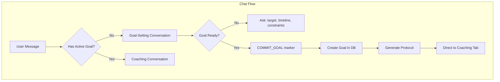

# Rewrite Eden Chat for Coaching

## Problem

The current chat logic in [`app/api/eden-coach/message/route.ts`](app/api/eden-coach/message/route.ts) is outdated:

- Generic coaching advice without goal commitment
- No connection to the coaching system (goals, protocols, actions, habits)
- Long, unfocused system prompt

## Solution

Rewrite the chat to be goal-centric with automatic protocol generation.




## Implementation

### 1. Rewrite System Prompt

New focused prompt (~50 lines vs current ~90):

```javascript
You are Eden, a health coach focused on helping users commit to goals and follow through.

CURRENT STATE:
- Has active goal: {yes/no}
- Goal: {description if exists}
- Protocol phase: {current/total if exists}

IF NO ACTIVE GOAL:
Your job is to help them define ONE clear goal. Ask about:
1. What they want to achieve (specific outcome)
2. Timeline (how many weeks)
3. Constraints (injuries, time limits, things they won't do)

Once you have all three, summarize and ask "Ready to commit?"
If they confirm, respond with: [COMMIT_GOAL]{"goal_type":"...","target_description":"...","duration_weeks":N,"constraints":{...}}

IF HAS ACTIVE GOAL:
- Reference their current protocol and progress
- Encourage, troubleshoot, adapt
- Keep responses short and actionable
```


### 2. Simplify Message Handler

Remove:

- `generateFirstMessage()` function (over-engineered)
- Complex first-message logic
- Unused plan references

Add:

- Check for `[COMMIT_GOAL]` in LLM response
- Create goal and generate protocol automatically
- Simple confirmation response

### 3. File Changes

**[`app/api/eden-coach/message/route.ts`](app/api/eden-coach/message/route.ts)** - Full rewrite:

- New concise `SYSTEM_PROMPT`
- Remove `generateFirstMessage()`
- Add goal commitment detection after LLM call
- Import and use `generateProtocolForGoal`

### 4. Expected Flow

**No active goal:**

```javascript
User: "I want to get stronger"
Eden: "Great! What does 'stronger' look like for you - a specific lift, body composition, or general fitness? And how many weeks do you want to work on this?"
User: "I want to do 10 pull-ups. Maybe 8 weeks?"
Eden: "Perfect. Any injuries or constraints I should know about?"
User: "Bad lower back, can't do heavy deadlifts"
Eden: "Got it. Goal: 10 pull-ups in 8 weeks. Constraint: no heavy deadlifts (lower back). Ready to commit?"
User: "Yes"
Eden: "Done! Your plan is ready - check the Coaching tab to see your milestones and daily actions."
```

**Has active goal:**

```javascript
User: "I'm struggling with the morning routine"
Eden: "I see you've completed 3/5 actions this week. What's making mornings tough - time, energy, or motivation?"


```